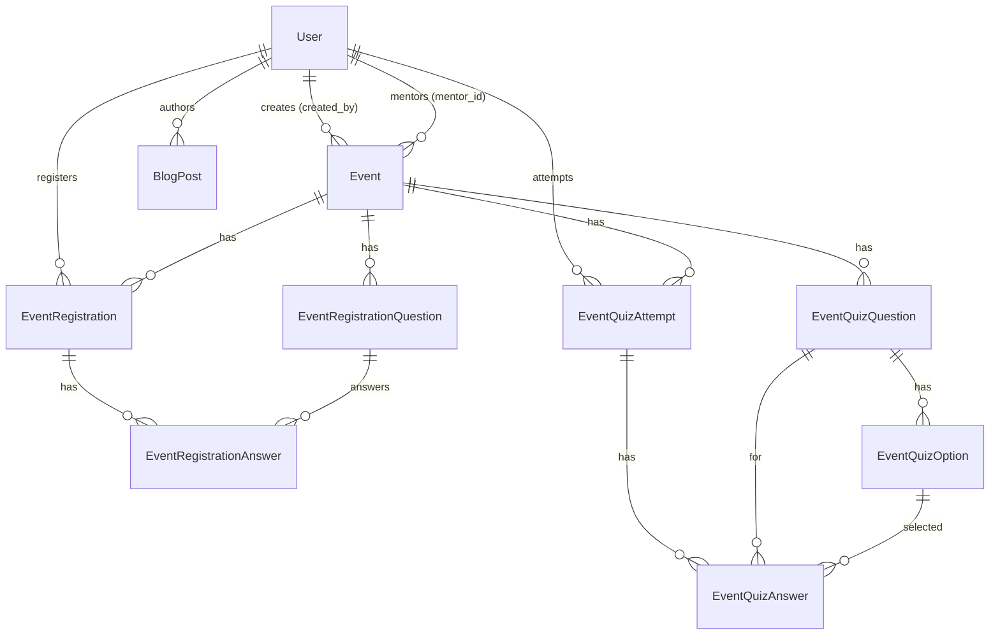

# Architecture & Design — Gakutsu Community

This document describes the **current implemented architecture**, not an imagined rewrite. Sections labeled _Intended Design_ describe planned behavior not yet implemented.

---

## 1. Request Lifecycle

```
Browser → Vite (dev) / Nginx (prod)
       → Laravel HTTP Kernel
       → Global Middleware (CSRF, sessions, cookies, Inertia, appearance)
       → Route Matching (web.php, settings.php)
       → Role Middleware (EnsureUserIsAdmin / EnsureUserIsMentor)
       → Controller (Form Request validation + policy authorization)
       → SeoPolicy resolves indexability/robots/canonical policy
       → SeoMetadata builds normalized metadata document
       → StructuredData builds approved JSON-LD
       → Blade (app.blade.php) renders initial SEO head fallback (when production SSR disabled)
       → Inertia::render() sends page payload
       → React hydrates CSR body
       → SeoHead component consumes normalized SEO document during Inertia client navigation
```

### Middleware Stack

Registered in [../bootstrap/app.php](../bootstrap/app.php):

| Middleware                         | Scope        | Purpose                                                                     |
| ---------------------------------- | ------------ | --------------------------------------------------------------------------- |
| `HandleAppearance`                 | Web (global) | Injects appearance cookie into Inertia shared data                          |
| `HandleInertiaRequests`            | Web (global) | Shares auth user, flash messages, and appearance with all Inertia responses |
| `AddLinkHeadersForPreloadedAssets` | Web (global) | HTTP/2 preload hints                                                        |
| `EnsureUserIsAdmin`                | Route group  | 403 if user is not admin                                                    |
| `EnsureUserIsMentor`               | Route group  | 403 if user is not mentor                                                   |

---

## 2. Route Boundaries

Defined in [../routes/web.php](../routes/web.php) and [../routes/settings.php](../routes/settings.php).

### Public Routes (unauthenticated)

| Route                | Controller                    | Purpose       |
| -------------------- | ----------------------------- | ------------- |
| `GET /`              | `Site\HomeController::index`  | Landing page  |
| `GET /blogs`         | `Site\BlogController::index`  | Blog listing  |
| `GET /blogs/{slug}`  | `Site\BlogController::show`   | Blog detail   |
| `GET /events`        | `Site\EventController::index` | Event listing |
| `GET /events/{slug}` | `Site\EventController::show`  | Event detail  |

### Authenticated Routes

| Route                                | Controller                                         | Purpose                       |
| ------------------------------------ | -------------------------------------------------- | ----------------------------- |
| `GET /dashboard`                     | Inline closure                                     | Member dashboard              |
| `GET /events/{slug}/register`        | `Site\EventController::register`                   | Registration form             |
| `POST /events/{event}/registrations` | `Event\EventRegistrationController::store`         | Submit registration           |
| `POST /editor/blog-images`           | `Blog\BlogEditorImageController::store`            | Editor image upload           |
| Settings routes                      | `Settings\ProfileController`, `SecurityController` | Profile, password, appearance |

### Admin Routes (`/admin/*`, requires `EnsureUserIsAdmin`)

Full CRUD for users, blogs, events. Nested resources for registration questions, quiz questions, quiz attempts, and manual grading.

### Mentor Routes (`/mentor/*`, requires `EnsureUserIsMentor`)

Same structure as admin but scoped to mentor's own content via policies. No user management.

### Commented-Out Routes (not active)

```php
// GET /events/{slug}/quiz — EventQuizController::show
// POST /events/{event}/quiz-attempts — EventQuizController::store
// GET /events/{slug}/quiz-result — EventQuizController::result
```

These are the member quiz access routes. The controller exists but returns `abort(404)`.

---

## 3. Authorization

### Policies

| Policy                    | Model               | Key behavior                                                                |
| ------------------------- | ------------------- | --------------------------------------------------------------------------- |
| `EventPolicy`             | `Event`             | `before()` grants admin full access; mentor checks `mentor_id === user->id` |
| `BlogPostPolicy`          | `BlogPost`          | Same pattern: admin override + mentor ownership via `author_id`             |
| `EventQuizAttemptPolicy`  | `EventQuizAttempt`  | Admin or mentor-of-event can view/grade; user can view own attempt          |
| `EventQuizQuestionPolicy` | `EventQuizQuestion` | Admin or mentor-of-event can CRUD                                           |

### Middleware Authorization

- `EnsureUserIsAdmin`: Checks `$user->role !== UserRole::Admin` → 403
- `EnsureUserIsMentor`: Checks `!$user->isMentor()` → 403

### Notable Design

- Admin and mentor route groups are separate (`/admin/*` vs `/mentor/*`), with separate controllers that often delegate to the same Action classes.
- The `before()` method in `EventPolicy` and `BlogPostPolicy` returns `true` for admins, bypassing all other policy checks.
- No `EventRegistrationPolicy` exists. Registration authorization is handled within the `EventPolicy::register` method and via middleware.

---

## 4. Controllers

Controllers follow HTTP orchestration patterns:

```
Controller
  → Validates input (Form Request)
  → Authorizes ($this->authorize() or policy)
  → Delegates to Action class
  → Returns Inertia::render() or redirect
```

### Controller Organization

```
Controllers/
├── Admin/          # 7 controllers — full platform management
├── Mentor/         # 6 controllers — own-content management
├── Site/           # 3 controllers — public pages (Home, Blog, Event)
├── Event/          # 3 controllers — member-facing actions (Registration, Quiz, Browse)
├── Blog/           # 1 controller — editor image upload
├── Settings/       # Profile + Security controllers
└── Controller.php  # Base controller
```

---

## 5. Action Classes

Domain logic is extracted into action classes in `app/Actions/`:

```
Actions/
├── Blogs/
│   ├── DeleteBlogPostAction
│   ├── GetBlogPostIndexAction
│   ├── StoreBlogPostAction
│   └── UpdateBlogPostAction
├── Events/
│   ├── DeleteEventAction
│   ├── GetEventDetailAction
│   ├── GetEventIndexAction
│   ├── GetEventRegistrationDetailAction
│   ├── GetEventRegistrationIndexAction
│   ├── GetEventRegistrationQuestionIndexAction
│   ├── StoreEventAction
│   ├── StoreEventRegistrationAction       # Validates availability, prevents duplicates, creates snapshots
│   ├── StoreEventRegistrationQuestionAction
│   ├── UpdateEventAction
│   ├── UpdateEventRegistrationQuestionAction
│   └── DeleteEventRegistrationQuestionAction
├── EventQuiz/
│   ├── GradeEventQuizAttemptAction        # Manual grading with score recalculation
│   ├── StoreEventQuizAttemptAction        # Submission with auto-grading + answer snapshots
│   └── UpsertEventQuizQuestionAction      # Create/update quiz questions with options
├── Fortify/                                # Fortify action overrides
├── Media/                                  # Image processing actions
└── Support/                                # Utility actions
```

---

## 6. Form Requests

Validation is handled by dedicated Form Request classes:

```
Requests/
├── Admin/       # StoreUserRequest, UpdateUserRequest
├── Blog/        # UpdateBlogPostRequest
├── Event/       # StoreEventRequest, UpdateEventRequest, EventIndexRequest,
│                # StoreEventRegistrationRequest, EventRegistrationIndexRequest,
│                # StoreEventRegistrationQuestionRequest, UpdateEventRegistrationQuestionRequest,
│                # EventRegistrationQuestionIndexRequest
├── EventQuiz/   # StoreEventQuizQuestionRequest, UpdateEventQuizQuestionRequest,
│                # StoreEventQuizAttemptRequest, GradeEventQuizAnswerRequest
└── Settings/    # Profile/password via Fortify or concerns
```

---

## 7. Models & Relationships

### Entity Relationship Diagram



### Models Summary

| Model                       | Key Fields                                                                                                                                          | Relationships                                                                      |
| --------------------------- | --------------------------------------------------------------------------------------------------------------------------------------------------- | ---------------------------------------------------------------------------------- |
| `User`                      | name, email, password, role (enum)                                                                                                                  | events, blogs, registrations, quiz attempts                                        |
| `Event`                     | title, slug, category, status, access_type, is_published, starts_at, ends_at, mentor_id, created_by, poster_image_path, meeting_url                 | mentor, creator, registrations, registrationQuestions, quizQuestions, quizAttempts |
| `EventRegistration`         | event_id, user_id, name_snapshot, email_snapshot, registered_at                                                                                     | event, user, answers                                                               |
| `EventRegistrationQuestion` | event_id, label, type, options (JSON), is_required, is_active, sort_order                                                                           | event, answers                                                                     |
| `EventRegistrationAnswer`   | registration_id, question_id, question_label_snapshot, answer_value                                                                                 | registration, question                                                             |
| `EventQuizQuestion`         | event_id, type, prompt, points, is_active, sort_order, explanation                                                                                  | event, options                                                                     |
| `EventQuizOption`           | question_id, option_text, is_correct, sort_order                                                                                                    | question                                                                           |
| `EventQuizAttempt`          | event_id, registration_id, user_id, status, auto_score, manual_score, total_score, max_score, submitted_at, graded_at                               | event, registration, user, answers                                                 |
| `EventQuizAnswer`           | attempt_id, question_id, option_id, *_snapshot fields, answer_text, needs_manual_grading, is_correct, awarded_score, feedback, graded_by, graded_at | attempt, question, option, grader                                                  |
| `BlogPost`                  | author_id, title, slug, status, cover_image_path, content, published_at                                                                             | author                                                                             |

### Enums

| Enum                            | Values                                           |
| ------------------------------- | ------------------------------------------------ |
| `UserRole`                      | Admin, Mentor, Member                            |
| `EventStatus`                   | Upcoming, Cancelled, Completed                   |
| `EventAccessType`               | Free, Paid                                       |
| `EventQuizQuestionType`         | MultipleChoice, ShortText                        |
| `EventQuizAttemptStatus`        | Submitted, Graded                                |
| `EventRegistrationQuestionType` | ShortText, LongText, Select                      |
| `BlogPostStatus`                | Draft, Published                                 |
| `MediaImagePreset`              | BlogCover, BlogContent, EventCover, ProfilePhoto |

---

## 8. Database Schema

13 migration files:

1. `create_users_table` — users with role column, 2FA columns
2. `create_cache_table` — Laravel cache
3. `create_jobs_table` — Laravel queue
4. `add_two_factor_columns_to_users_table` — Fortify 2FA
5. `create_blog_posts_table` — blog posts
6. `create_events_table` — events with composite indexes
7. `create_event_registrations_table` — registrations with user snapshot
8. `create_event_registration_questions_table` — custom questions per event
9. `create_event_registration_answers_table` — answers to custom questions
10. `create_event_quiz_questions_table` — quiz questions per event
11. `create_event_quiz_options_table` — MC options per question
12. `create_event_quiz_attempts_table` — quiz attempts with scores (unique on `event_id + user_id`)
13. `create_event_quiz_answers_table` — individual answers with grading data

### Development Migration Policy

During development, existing migration files may be edited directly and `migrate:fresh` is acceptable. This policy **must change** after the first production release — subsequent schema changes must use new migration files.

---

## 9. Frontend Architecture

### Page Structure

Inertia pages are organized by domain:

```
pages/
├── admin/
│   ├── blogs/index.tsx
│   ├── events/{index,create,edit,show}.tsx
│   ├── events/questions/index.tsx
│   ├── events/registrations/{index,show}.tsx (via features)
│   ├── events/quiz-questions/index.tsx
│   ├── events/quiz-attempts/{index,show}.tsx
│   └── users/index.tsx
├── mentor/
│   ├── blogs/index.tsx
│   └── events/ (mirrors admin structure)
├── events/{index,show,register}.tsx     # Public event pages
├── blogs/{index,show}.tsx               # Public blog pages
├── auth/                                # Login, register, etc.
├── settings/                            # Profile, security, appearance
├── dashboard.tsx
└── welcome.tsx                          # Landing page
```

### Feature Modules

Feature logic is organized by domain in `resources/js/features/`:

- **blogs/** — editor, form fields, table, management page, types, hooks
- **events/** — event card, form fields, table, management pages, registration, types, hooks
- **quizzes/** — quiz question management, attempt listing, attempt detail, grading UI
- **users/** — user table, dialogs (create, edit, delete), form fields

### Shared Components

- `components/ui/` — 32 shadcn/ui components (button, dialog, select, table, badge, etc.)
- `components/data-table/` — reusable table infrastructure (pagination, toolbar, sorting, empty state)
- `components/forms/` — date-time picker field
- `components/navigation/` — context back button
- `components/public/` — public-facing cards, reveal animations, SEO head, footer
- `components/rich-text/` — rich text rendering
- `components/feedback/` — flash toaster listener
- `components/landing/` — landing page cards

### Layouts

| Layout          | Used By                     | Features                        |
| --------------- | --------------------------- | ------------------------------- |
| `app-layout`    | Admin, Mentor, Dashboard    | Sidebar navigation, breadcrumbs |
| `auth-layout`   | Login, Register, etc.       | Centered card                   |
| `public-layout` | Events, Blogs, Registration | Top navigation, footer          |

### Wayfinder Integration

Laravel Wayfinder auto-generates TypeScript route functions. The Vite plugin is configured with `formVariants: true`. Generated files live in `resources/js/wayfinder/`.

### SSR and Production Rendering Modes

The application supports two rendering configurations:

- **Production Mode:** Page bodies are client-side rendered (CSR) with `INERTIA_SSR_ENABLED=false`. Production hosting does not run a persistent Node SSR process. Initial page head metadata (`<title>`, `<meta>`, canonical, JSON-LD) is rendered server-side by PHP in `resources/views/app.blade.php`.
- **Development and CI Mode:** Vite SSR builds (`npm run build:ssr`) and automated SSR smoke checks (`node scripts/ssr-smoke-check.mjs`) are executed during CI and local testing to validate hydration safety, server bundle creation, and component SSR rendering compatibility.

---

## 10. Event Lifecycle

```
Created (is_published=false, status=upcoming)
    │
    ├── Publish (is_published=true)
    │       │
    │       ├── Registration open (until registration_closes_at or starts_at)
    │       │       │
    │       │       └── Members register
    │       │
    │       ├── Event occurs (starts_at → ends_at)
    │       │
    │       └── Mark as completed (status=completed)
    │               │
    │               └── Quiz available (if active quiz questions exist)
    │                       │
    │                       ├── Members take quiz ← NOT YET IMPLEMENTED
    │                       └── Admin/Mentor grade written answers
    │
    └── Cancel (status=cancelled)
```

## 11. Quiz Lifecycle

```
Quiz Questions Created (by admin/mentor)
    │
    ├── Options added (for MC questions)
    ├── Activate questions (is_active=true)
    │
    └── Event completed + quiz available
            │
            ├── Member submits answers ← NOT YET IMPLEMENTED (routes commented out)
            │       │
            │       ├── MC answers auto-graded (awarded_score set, is_correct computed)
            │       └── Short text answers flagged (needs_manual_grading=true)
            │
            └── Admin/Mentor grades manually
                    │
                    ├── Sets awarded_score and feedback per answer
                    └── refreshScores() recalculates attempt totals
                            │
                            └── When all manual answers graded → status=graded
```

---

## 12. Media Upload

Image processing uses Intervention Image (v4) via `ProcessImageUploadAction`:

- Blog cover images → stored in `public` disk
- Blog content images → uploaded via `BlogEditorImageController`
- Event poster images → stored in `public` disk
- `MediaImagePreset` enum defines presets: BlogCover, BlogContent, EventCover, ProfilePhoto
- `MediaPathGenerator` (in `app/Support/Media/`) handles path generation

---

## 13. Error Handling

- Laravel exception handler in `bootstrap/app.php` (currently empty — default behavior)
- Flash messages via Inertia shared data (`HandleInertiaRequests` middleware)
- Toast notifications via Sonner (`FlashToasterListener` component)
- Form validation errors rendered inline via Inertia form helpers
- 404 for unpublished events, unauthorized access
- 403 via middleware for role checks

---

## 14. Security Considerations

### Implemented

- CSRF protection (Laravel default)
- Password hashing (bcrypt via cast)
- Role-based middleware (`EnsureUserIsAdmin`, `EnsureUserIsMentor`)
- Policy-based authorization with admin override
- Mass assignment protection via `#[Fillable]` attributes
- Hidden sensitive attributes on User model (`#[Hidden]`)
- Input validation via Form Requests
- DOMPurify for rich text rendering (client-side)
- Two-factor authentication
- Email verification
- Rate limiting on login and password update

### To Verify

- Meeting URL validation/sanitization (stored as free-text string)
- File upload type/size restrictions
- Quiz answer access privacy (can a member view other members' answers?)
- IDOR prevention on nested resources (partially addressed with `abort_unless` checks)

---

## 15. Test Architecture

- **Framework:** Pest v4 with PHPUnit v12
- **Base class:** `tests/TestCase.php` extends Laravel's TestCase, adds `skipUnlessFortifyHas()`
- **Pest config:** `tests/Pest.php` — extends TestCase with `RefreshDatabase` active, executing against an isolated testing database.
- **Factories:** User, BlogPost, Event (factories for quiz models are tracked in open tech debt).
- **Current tests:** Auth flows, Dashboard, Settings, Public SEO head fallback, Public event privacy, Public home payload projections.
- **Backlog:** Full CRUD feature test coverage (P0-10) is deferred to P1/P2.

---

## 16. Performance and Query Design

This section defines practical performance rules proportionate to a community side project. Do not introduce caching layers, CDNs, or distributed infrastructure without a demonstrated requirement.

### Public Payload Design

- **Explicit Projections:** Controllers rendering public aggregate pages (e.g., `HomeController::index`) must pass explicit array projections or lightweight DTOs rather than serializing full Eloquent model instances.
- **No Direct Model Leakage:** Avoid passing unprojected models to public views where a smaller public contract is sufficient.
- **Authorization Boundary:** Exclude authorization-sensitive fields (such as `meeting_url` or internal relationship keys) before Inertia serialization.
- **TypeScript Alignment:** Frontend prop types must explicitly align with the restricted backend payload contract.
- **Storage Path Isolation:** Expose absolute public asset URLs while keeping internal storage disk paths hidden.

### Backend

- **Prevent N+1 queries.** Eager-load relationships that are displayed on the page. Use `with()` based on what the page actually renders, not speculatively.
- **Paginate all list views.** Admin and mentor index pages must use `paginate()` or `simplePaginate()`. Never load an unbounded collection of events, registrations, quiz attempts, or blog posts.
- **Bound nested queries.** Queries inside loops or mapped collections must use relationship methods that are already eager-loaded. Avoid lazy-loading inside foreach.
- **Scope Inertia props.** Return only the data a page renders. Do not pass full model instances when only a few attributes are needed. Use array selection or API Resources.

### Frontend

- **Avoid unnecessary re-renders.** Use stable prop shapes. Do not create inline objects or functions as component props where a reference would serve.
- **Use deferred Inertia props** for slow secondary data (e.g., registration counts) so that primary page content is not blocked.
- **Minimize bundle size.** Import only what is used from lucide-react and other icon libraries. Tree-shaking is available but requires named imports.

### SSR

- Do not use browser-only APIs (`window`, `matchMedia`, `document`) in render paths or at module load time. Wrap them in `useEffect` or check `typeof window !== 'undefined'`.
- Avoid synchronous `setState` inside `useEffect` on values that differ between server and client — these cause hydration mismatches.

---

## 17. Proportionate Scalability

This is a community side project. Architecture decisions must be proportionate to that scale.

**Do not introduce:**

- Microservices or service-based decomposition
- Message brokers or event buses
- Kubernetes or container orchestration
- Redis or external caching without a demonstrated bottleneck
- Repository pattern, service layers, or interfaces layered over the existing Action pattern
- Speculative abstractions not backed by concrete use cases in the repository

**When performance issues appear:**

1. Identify the specific query or render using the Laravel debugbar or query logs.
2. Add eager loading or an index to address the identified cause.
3. Use `simplePaginate()` if cursor-based pagination is sufficient.
4. Document the finding and fix in a focused, reviewed change.

---

## 18. Frontend Component and shadcn/ui Conventions

All UI work must follow these rules:

- **Use shadcn/ui primitives first.** Before creating a custom component, check `resources/js/components/ui/` (32 components available). Do not replace existing shadcn/ui components with custom alternatives.
- **Use the shared data-table infrastructure.** Admin and mentor list pages must use `data-table/`, `pagination-bar`, `sortable-header`, `index-toolbar`, and `empty-state-row` from `resources/js/components/data-table/`. Do not build isolated table components.
- **Use existing feature modules.** Check `resources/js/features/` before adding code to a page component directly. Feature-specific forms, tables, dialogs, and hooks belong in the feature module.
- **Keep pages thin.** Inertia page components in `resources/js/pages/` should compose feature components, not contain domain logic.
- **Follow the layout system.** Use `app-layout` (sidebar, admin/mentor/dashboard), `auth-layout` (centered card), or `public-layout` (top nav, footer) as appropriate. Do not create new top-level layouts without approval.
- **Consistent loading states.** Pages using deferred Inertia props must include animated skeleton placeholders, not blank areas or spinners alone.
- **Consistent empty states.** Use the `ui/empty-state.tsx` component where applicable.
- **Consistent success and error feedback.** Use the Sonner toast system via the `FlashToasterListener` pattern. Do not implement isolated notification systems.

---

## 19. Accessibility and Responsive Design

- **Keyboard accessibility.** All interactive elements (buttons, links, form fields, dialogs, dropdowns) must be reachable and operable by keyboard alone. Do not suppress default focus behavior.
- **Visible focus states.** Do not use `outline: none` or `focus:outline-none` without a visible alternative focus indicator.
- **Dark mode.** All pages and components must respect the dark mode preference set via the `HandleAppearance` middleware and `use-appearance` hook. Test new components in both light and dark modes.
- **Responsive design.** All pages must be usable on mobile screen widths. Use the existing Tailwind responsive utilities. Do not hard-code pixel widths for layout containers.
- **Semantic HTML.** Use appropriate HTML5 elements (`<main>`, `<nav>`, `<section>`, `<article>`, `<button>` vs `<div onClick>`). Do not use `div` for interactive elements.
- **Form labels.** Every form input must have an associated label. Do not rely on placeholder text as the only label.
